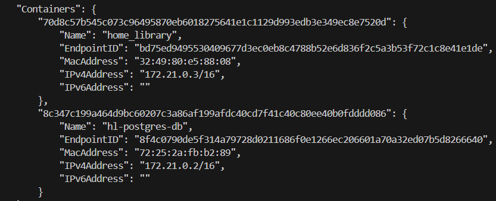

# Home Library Service

## Downloading

```
git clone {repository URL}
```

## Installing NPM modules

```
npm install
```

## Creating .ENV file

Create .env file based on .env.example file.

## Docker

To check that user-defined bridge is configured, use the following command:

```
npm run check:bridge

```

There you can find 2 containers (home_library, hl-postgres-db) attached to the 'nodejs2025q2-service-\_hl_network'network.



To check that the app restarts upon changes in src, run docker with --watch flag:

```
docker-compose up --watch

```

Make any changes in src folder, set focus into the terminal, wait for 'home_library has been recreated' message to appear.

To check that the final size of the Docker image with application is less 500mb, run the following command:

```
docker images

```

There you can see 'nodejs2025q2-service--app' repository which you should check.

## Running application

```
npm run start
```

After starting the app on port (4000 as default) you can open
in your browser OpenAPI documentation by typing http://localhost:4000/doc/.
For more information about OpenAPI/Swagger please visit https://swagger.io/.

## Testing

After application running open new terminal and enter:

To run all tests without authorization

```
npm run test
```

To run only one of all test suites

```
npm run test -- <path to suite>
```

To run all test with authorization

```
npm run test:auth
```

To run only specific test suite with authorization

```
npm run test:auth -- <path to suite>
```

### Auto-fix and format

```
npm run lint
```

```
npm run format
```

### Debugging in VSCode

Press <kbd>F5</kbd> to debug.

For more information, visit: https://code.visualstudio.com/docs/editor/debugging
